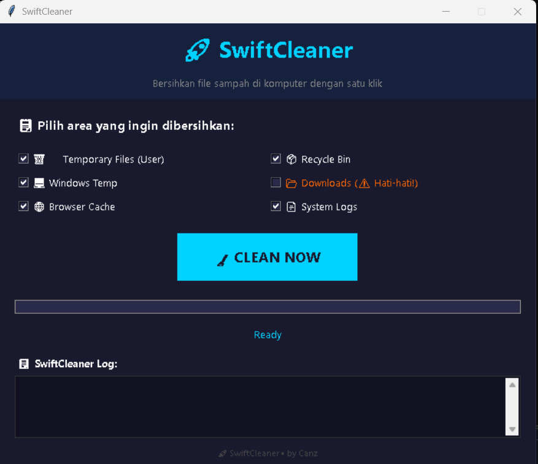

# 🚀 SwiftCleaner

**SwiftCleaner** is a lightweight, easy-to-use system cleaner for Windows.  
Clean temporary files, browser cache, recycle bin, and more — all with a single click!

---

## 📸 Screenshot



---

## ✨ Features

| Feature | Description |
|---------|-------------|
| 🗑️ **User Temporary Files** | Clean `%temp%` folder |
| 💻 **Windows Temp** | Clean `C:\Windows\Temp` |
| 🌐 **Browser Cache** | Clean cache from Chrome, Firefox, and Edge |
| 📦 **Recycle Bin** | Empty recycle bin automatically |
| 📂 **Downloads** | Clean downloaded files (⚠️ use with caution!) |
| 📄 **System Logs** | Clean Windows log files |
| ⚡ **Modern GUI** | Clean, dark-themed interface |
| 🚀 **One-click Cleanup** | Just click "CLEAN NOW" and let it work |

---


## ⚠️ Notes

- Windows may show a warning because it's an executable file. Click **"Run Anyway"**.
- No installation required — just download and run!
- Make sure to close important files before cleaning Downloads folder.

---

## 📥 Download

**Version:** 1.0.0  
**File:** [SwiftCleaner.exe](https://github.com/CandStudio/Swift-Cleaner/blob/main/SwiftCleaner.exe)  
**Platform:** Windows 7 / 8 / 10 / 11

---

## 🛠️ Requirements

SwiftCleaner requires:

* 🪟 Windows 7 / 8 / 10 / 11
* 🐍 **Python**

> ⚠️ **Python must be installed** if you are running SwiftCleaner.

### 📥 Install Python

Download Python from:

https://www.python.org/downloads/

During the installation process, make sure to check:

```text
☑ Add Python to PATH
```


## 👨‍💻 Author

**Canz**  
GitHub: [@CandStudio](https://github.com/CandStudio)

---


## ⭐ Support

If you like this tool, give it a ⭐ on GitHub!
